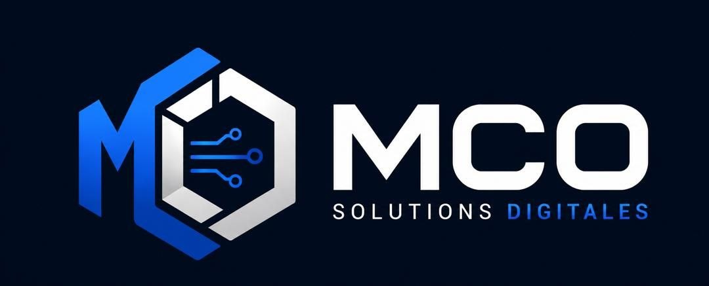

  

### Salut, moi c’est Candice 👋

Diplômée d’une **Licence en Génie logiciel** (option Développement web).  
Fondatrice de **[MCO Solutions Digitales](https://github.com/amoumich)** — entreprise individuelle (développement web, applications de gestion, data).

Basée à **Libreville, Gabon**.

---

### Ce que je fais

- Applications web
- Sites & outils sur mesure pour entreprises et organismes
- Stack principale : **Laravel / PHP**, **Django / Python**, **JavaScript** — on peut toucher ailleurs selon le besoin
- Intérêt pour la **data science** appliquée à la biologie et à la santé

---

### Projets

| Projet | Stack | Démo |
|--------|--------|------|
| **ECC_BN** — gestion interne paroisse | Laravel | [bethlehemnouveau.ga](https://bethlehemnouveau.ga) |
| **Gestion Scolarité** | Laravel | [lypeg-upsa.org](https://lypeg-upsa.org) |
| **WITECH** — plateforme de gestion interne | Django | Réseau interne |
| **DFM-IT** — gestion interne entreprise | Django | — |
| **mini-cursor** — éditeur / IA de coding | Web app | — |

> Liens vers les applications en ligne (pas le code source).

---

### Stack

Principale : `Python` · `Django` · `PHP` · `Laravel` · `JavaScript` · `HTML/CSS` · `SQL` · `Git` · `Docker`

Ouverte à d’autres technos selon le projet.

---

### Contact

- GitHub : [amoumich](https://github.com/amoumich)
- Entreprise : **MCO Solutions Digitales** (EI)
- Localisation : Libreville, Gabon

*Ouverte aux missions freelance, projets clients et collabs tech.*
